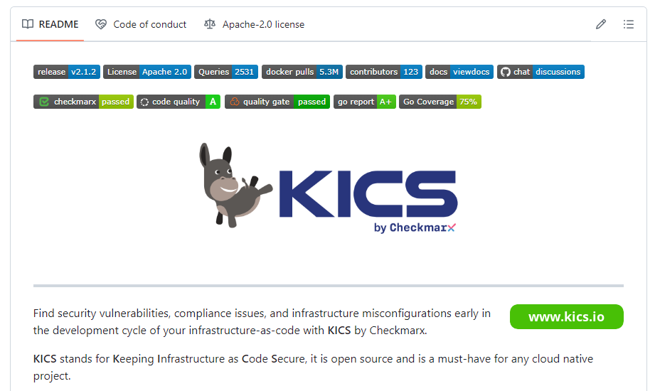

# Introduction

GitHub README badges provide a means to succinctly convey information
about a repository. For example, information about the latest release,
the license, code coverage, etcetera. For example, the following image
shows the start of the README of the
[KICS](https://github.com/Checkmarx/kics) project, as rendered by
GitHub.



This repo explains one approach to creating a badge that reports the
status of the CxSAST scan of a repository.

# High-level Overview

The solution consists of four items:

- A CxSAST server that contains a project for the repository.
- A web server that queries the CxSAST server for the state of the
  project in response to a request and returns an appropriately
  formatted response.
- A badge-generating site, such as [shields.io](https://shields.io)
  that consumes the response and generates an image for display in a
  markdown file.
- A markdown file that includes a specially formatted fragment
  generated by the badge-generating site.

# The Web Server

The code in this repository is a simple, proof-of-concept
[Flask](https://flask.palletsprojects.com/en/3.0.x/) application that
uses the [Checkmarx Python
SDK](https://github.com/checkmarx-ts/checkmarx-python-sdk) to interact
with a CxSAST instance. It consumes `GET` requests to its `/badge`
endpoint and returns a JSON response compliant with the schema
described on the shields.io [Endpoint
Badge](https://shields.io/badges/endpoint-badge) page.

It is a fairly rudimentary implementation. It exposes a
`/badge/{project_id}` endpoint. It tries to retrieve the latest scan
for the project specified by the request. If the project has never
been scanned, it returns immediately. Otherwise, if the scan has
finished, it retrieves the scan’s results statistics and, if no
vulnerabilities were found, returns a badge with the word “passed” on
a green background.

As the Checkmarx Python SDK is used to interact with the CxSAST
instance, the details and credentials for the CxSAST instance can be
provided either via a `config.ini` file in a `.Checkmarx` directory in
the user’s home directory, or via environment variables.

The `SAST_BADGE_LOG_LEVEL` environment variable can be used to set the
application’s log level.

# Deployment

For shields.io to be able to reach the web server, it must be exposed
to the public internet. At the same time, the web server must be able
to connect to the CxSAST server. There are any number of possible
solutions.

As noted on Flask’s [Development
Server](https://flask.palletsprojects.com/en/3.0.x/server/), the Flask
development server should not be used for production deployment as it
“is not designed to be particularly efficient, stable or
secure”. Instead, a [WSGI
server](https://www.fullstackpython.com/wsgi-servers.html) should be
used.

## Example: Waitress

As an example, to use
[Waitress](https://docs.pylonsproject.org/projects/waitress/en/stable/)
to deploy the Flask application, first install Waitress:

```
pip install waitress
```

This should result in an executable named `waitress-serve` being added
to the command execution path.

To run the application:
```
waitress-serve --call sastbadge:create_app
```

By default, Waitress will use port 8080. The `--port` command line
option can be used to specify a different port.

See
[here](https://flask.palletsprojects.com/en/2.3.x/deploying/waitress/)
for more information.

# Generating a Badge

Once the web server is deployed and has a publicly accessible URL, the
markdown code for the badge can be generated using the shields.io
Endpoint Badge page (linked to above).
